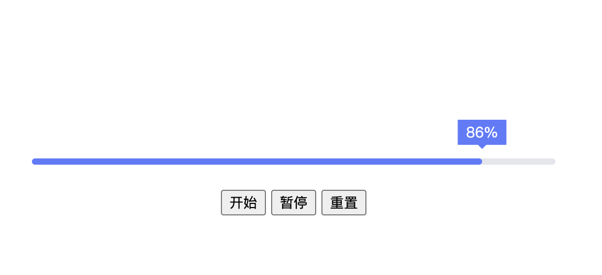

# progress

## 

1. css variable 来显示 progress text 跟 progress percent

2. requestAnimationFrame 和 cancelAnimationFrame 来展示进度条动画

3. document.documentElement.style.setProperty("--percent", percent);
